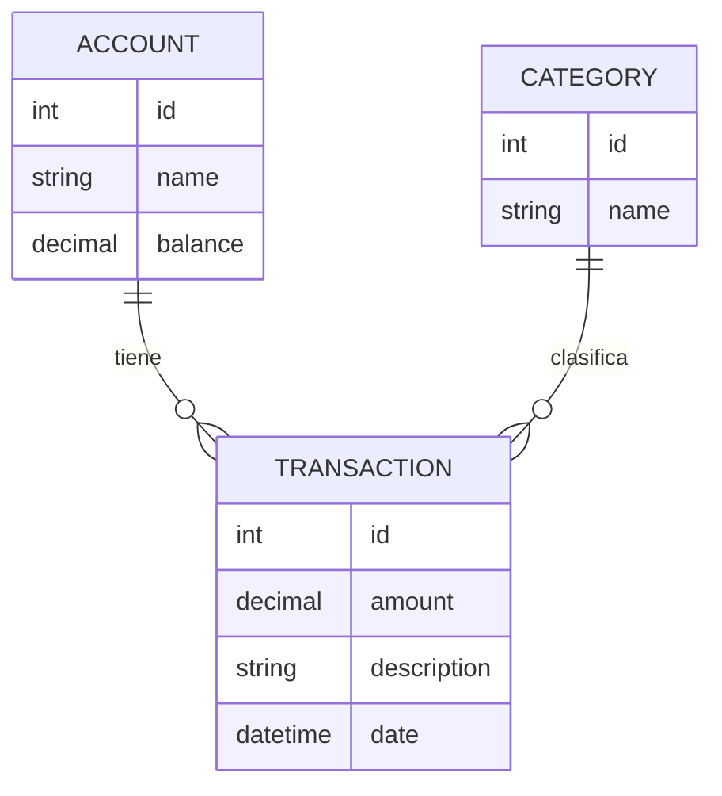

# Modelos
Esta sección describe los modelos de datos ubicados en `models/`.

## ORM (Object-Relational Mapping o Mapeo Objeto-Relacional): Peewee
Para interactuar con la [Base de Datos](DATABASE.md), utilizamos [Peewee](https://docs.peewee-orm.com/en/latest/), un ORM ligero para Python.

**¿Qué hace Peewee?**
* Permite definir tablas como clases de Python.
* Evita escribir SQL manualmente para operaciones comunes.

> [!TIP]
> Para trabajar con estos modelos, es importante conocer el funcionamiento de las consultas en [Peewee](https://docs.peewee-orm.com/en/latest/). Puedes consultar la [Guía Rápida de Peewee](https://docs.peewee-orm.com/en/latest/peewee/quickstart.html#querying) para aprender a buscar, filtrar y ordenar registros de los modelos.

## Implementación de modelos
Para mantener la coherencia en la [Base de Datos](DATABASE.md) y el funcionamiento del ORM, todos los modelos deben implementarse siguiendo estrictamente las siguientes indicaciones:

### Requisitos de definición
Cada modelo debe definirse en su propio archivo dentro de `models/`. La clase debe heredar directamente de `pw.Model` y contener una clase interna obligatoria llamada `Meta`. En esta clase interna se debe asignar la instancia de `db` (importada desde `services.database`) al atributo `database`; Esto vincula el modelo a la [Base de Datos](DATABASE.md).

> [!IMPORTANT]
> **Documentación obligatoria**: Para asegurar la legibilidad del código, es necesario explicar qué representa el modelo y listar detalladamente sus atributos dentro del *docstring* de la clase.

```python
import peewee as pw
from services.database import db


class MyNewModel(pw.Model):
    """
    Descripción breve del modelo

    Attributes:
        id (AutoField): Clave primaria única. Se genera automáticamente para 
                identificar cada cuenta en la base de datos.
        name (CharField): Descripción del campo.
    """

    id = pw.AutoField()
    name = pw.CharField()

    class Meta:
            database = db  # Vincula el modelo con la conexión a la base de datos
```
### Estándar de Campos y Tipos
Utilizamos los siguientes tipos de datos de Peewee para asegurar la integridad de la información y la consistencia en la [Base de Datos](DATABASE.md):

#### Identificadores y Texto
* **Llave Primaria:** Usa siempre `pw.AutoField()`. Se encarga de crear un identificador único, entero y autoincremental para cada registro.
* **Texto Corto:** Usa `pw.CharField()`. Ideal para nombres, títulos o categorías (máximo 255 caracteres por defecto).
* **Texto Largo:** Usa `pw.TextField()`. Utilízalo para notas, comentarios extensos o descripciones que puedan superar un párrafo.

#### Números y Finanzas
* **Dinero (Obligatorio):** Usar `DecimalField(max_digits=20, decimal_places=2)`. **Nunca uses FloatField** para valores monetarios, ya que los errores de redondeo binario pueden causar descuadres en las cuentas.
* **Números Enteros:** Usa `IntegerField()` para contadores o valores que no requieran decimales.
* **Valores Booleanos:** Usa `BooleanField()` para estados tipo Sí/No (ej. `is_active`, `is_verified`).

#### Fechas y Relaciones
* **Fechas y Tiempo:** Usa `DateTimeField()`. Es recomendable pasar `default=datetime.datetime.now` para registrar automáticamente el momento de creación.
* **Relaciones (FK):** Usa `pw.ForeignKeyField(ModeloPadre, backref='nombre_plural', on_delete='CASCADE')`.
    * **Backref:** El nombre debe ser en plural (ej. `transactions`), ya que representa la colección de objetos relacionados que "viven" en el modelo padre.
    * **Integridad:** Define siempre el comportamiento de borrado (`on_delete`).


#### Configuración de Atributos (Constraints)
Para mejorar la calidad de los datos, utiliza estos parámetros adicionales cuando sea necesario:
* `null=False`: Para campos obligatorios (valor por defecto en Peewee).
* `unique=True`: Para campos que no deben repetirse (ej. nombre de una cuenta única).
* `default=valor`: Para asignar un valor automático si no se proporciona uno.

## Cátalogo de Modelos
En esta sección se definen los modelos actuales de **Myconta**.

### 1. Account (Cuenta)
Representa una fuente de ingresos o entidad financiera (Ej. Efectivo, Tarjeta de Débito, Ahorros).  
| Atributo | Tipo Peewee | Descripción |
| :--- | :--- | :--- |
| `id` | `AutoField` | Identificador único autoincremental |
| `name` | `CharField` | Nombre de la cuenta (único). |
| `balance` | `DecimalField` | Saldo disponible. |
| `currency` | `CharField` | Código de moneda (Ej. 'MXN', 'USD'). |

### 2. Category (Categoría)
Permite clasificar los movimientos para generar reportes estadísticos (Ej. Comida, Transporte, Entretenimiento).

| Atributo | Tipo Peewee | Descripción |
| :--- | :--- | :--- |
| `id` | `AutoField` | Identificador único autoincremental. |
| `name` | `CharField` | Nombre de la categoría. |
| `icon` | `CharField` | Referencia al icono para la interfaz gráfica. |

### 3. Transaction (Transacción)
Representa cada movimiento de dinero realizado. Es el eje central de la aplicación.

| Atributo | Tipo Peewee | Descripción |
| :--- | :--- | :--- |
| `id` | `AutoField` | Identificador único autoincremental. |
| `account` | `ForeignKeyField` | Relacimión con la cuenta (Vínculo a `Account`). |
| `category` | `ForeignKeyField` | Relación con la categoría (Vínculo a `Category`). Permite `null` para manejo de borrado. |
| `amount` | `DecimalField` | Monto del movimiento (positivo o negativo). |
| `description` | `CharField` | Concepto breve del movimiento. |
| `date` | `DateField` | Fecha del registro. |

## Mapa de Relaciones
Para mantener la integridad de los datos, las relaciones se gestionan de l siguiente manera:

* **Account ↔ Transaction**: Una cuenta tiene muchas transacciones. Si se elimina una cuenta, sus transacciones se eliminan en cascada (`CASCADE`).
* **Category ↔ Transaction**: Una categoría puede estar presente en muchas transacciones. Si se elimina una categoría, las transacciones quedan como "Sin categoría" (`SET NULL`).

